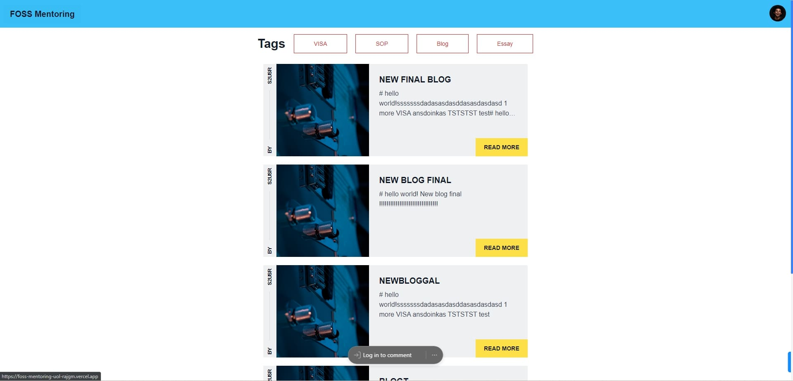

# FOSSMentoring Documentation

## Overview

"FOSSMentoring" is a web application built using [Next.js](https://nextjs.org/). 
The project focus on mentoring and opportunities.

<a href="https://youtu.be/VgD0BMNHuRk">
  
</a>

## Table of Contents

- [FOSSMentoring Documentation](#fossmentoring-documentation)
  - [Overview](#overview)
  - [Table of Contents](#table-of-contents)
  - [Getting Started](#getting-started)
  - [Installation](#installation)
  - [Key Features](#key-features)
  - [Homepage](#homepage)
  - [Mentor Page](#mentor-page)
  - [Blog Page](#blog-page)
  - [Chat Page](#chat-page)
  - [Dashboard](#dashboard)
  - [Sign In/Enter Page](#sign-inenter-page)
  - [Opportunities Page](#opportunities-page)
  - [Additional Information](#additional-information)
- [API Documentation](#api-documentation)
  - [Endpoints](#endpoints)
    - [POST `/api/add`](#post-apiadd)
      - [Request Body:](#request-body)
      - [Headers:](#headers)
      - [Responses:](#responses)
    - [POST `/api/book`](#post-apibook)
  - [Overview](#overview-1)
  - [Request](#request)
    - [Headers:](#headers-1)
    - [Body:](#body)
  - [Response](#response)
    - [Success:](#success)
    - [Errors:](#errors)
  - [Functionality](#functionality)
  - [Dependencies](#dependencies)
    - [POST `/api/createChat`](#post-apicreatechat)
  - [Overview](#overview-2)
  - [Request](#request-1)
    - [Headers:](#headers-2)
    - [Body:](#body-1)
  - [Response](#response-1)
    - [Success:](#success-1)
    - [Errors:](#errors-1)
  - [Functionality](#functionality-1)
  - [Dependencies](#dependencies-1)
    - [POST `/api/edit`](#post-apiedit)
  - [Overview](#overview-3)
  - [Request](#request-2)
    - [Headers:](#headers-3)
    - [Body:](#body-2)
  - [Response](#response-2)
    - [Success:](#success-2)
    - [Errors:](#errors-2)
  - [Functionality](#functionality-2)
  - [Dependencies](#dependencies-2)
    - [POST `/api/update`](#post-apiupdate)
  - [Overview](#overview-4)
  - [Request](#request-3)
    - [Headers:](#headers-4)
    - [Body:](#body-3)
  - [Response](#response-3)
    - [Success:](#success-3)
    - [Errors:](#errors-3)
  - [Functionality](#functionality-3)
  - [Dependencies](#dependencies-3)
    - [POST `/api/verify`](#post-apiverify)
  - [Overview](#overview-5)
  - [Request](#request-4)
    - [Headers:](#headers-5)
  - [Response](#response-4)
    - [Success:](#success-4)
    - [Errors:](#errors-4)
  - [Functionality](#functionality-4)
  - [Dependencies](#dependencies-4)
- [Technologies Used](#technologies-used)
  - [Programming Languages](#programming-languages)
  - [Frameworks \& Libraries](#frameworks--libraries)
  - [Cloud \& Deployment](#cloud--deployment)
  - [UI \& Design](#ui--design)
  - [Third Party APIs](#third-party-apis)
  - [Extensions \& Tools](#extensions--tools)

## Getting Started

## Installation

Clone the repository or download the ZIP file.

```bash
Navigate to the project directory.
git clone https://github.com/RajGM/FOSSMentoring.git

Install the dependencies.
cd FOSSMentoring

Install the dependencies.
npm install

Add API keys to .env.local file

Run the development server.
npm run dev

Open your web browser and visit http://localhost:3000 to access the application.
```

Visit [http://localhost:3000](http://localhost:3000) in your browser to access the application.

## Key Features

---

## Homepage
**Route:** `/pages/index.tsx`

**Description:**  
The homepage displays posts based on tags such as "VISA", "SOP", "Blog", and "Essay". It provides functionalities for users to load more posts and navigate through them.

---

## Mentor Page
**Route:** `/pages/[username]/index.tsx`

**Description:**  
This page allows users to search for mentors. They can search either by organization or by the name of a person. The results will display relevant mentor profiles.

---

## Blog Page
**Route:** `/pages/blog/`

**Description:**  
A dedicated space for users to read and explore various blogs. The content can range from informative articles to user experiences and more.

---

## Chat Page
**Route:** `/pages/chat`

**Description:**  
This page facilitates communication between users. It provides a platform for direct messaging, group chats, and other communication-related features.

---

## Dashboard
**Route:** `/pages/dashboard`

**Description:**  
The dashboard is a central hub for users. It provides functionalities like checking university emails, setting availability, managing sessions, updating profiles, and more. Users can also view their activities and notifications here.

---

## Sign In/Enter Page
**Route:** `/pages/enter`

**Description:**  
This is the entry point for users to log in to the platform. It supports authentication via Google. If a user is logging in for the first time, they will be prompted to choose a username.

---

## Opportunities Page
**Route:** `/pages/opp`

**Description:**  
The opportunities page is dedicated to showcasing various opportunities available for users. This could range from job listings to events or other types of opportunities.

---

## Additional Information

The project uses `next/font` to automatically optimize and load Inter, a custom Google Font. For more details on deploying the Next.js app, refer to the [Vercel Platform](https://vercel.com/new?utm_medium=default-template&filter=next.js&utm_source=create-next-app&utm_campaign=create-next-app-readme) and the [Next.js deployment documentation](https://nextjs.org/docs/deployment).

# API Documentation

**Version:** 1.0.0

## Endpoints

### POST `/api/add`

**Summary:** Add new event

**Description:** Endpoint to add a new event.

#### Request Body:

- **Format:** `application/json`
  - `postedBy` (string): Username of the poster.
  - `eventN` (string): Event name.
  - `link` (string): Link to the event.
  - `appS` (string): Application Starts.
  - `appE` (string): Application Ends.
  - `eventS` (string, optional): Event Starts.
  - `eventE` (string, optional): Event Ends.

#### Headers:

- `authorization` (string): Authorization token. **Required**
- `category` (string): Category of the event. **Required**

#### Responses:

- **200 OK**: Event added successfully.
  - **Content-Type:** `application/json`
    - `success` (string): Success message.

- **400 Bad Request**: Missing or invalid headers.
  - **Content-Type:** `application/json`
    - `error` (string): Error message.

### POST `/api/book`

## Overview

This endpoint is designed to handle the booking functionality. It verifies the authorization, creates an ICS event, sends emails to the relevant parties, and updates the booking slots in the database.

## Request

### Headers:

- `authorization` (string): Authorization token. **Required**

### Body:

- `mentor` (string): Username of the mentor.
- `start` (string): Start time of the event.
- `end` (string): End time of the event.
- `summary` (string): Summary of the event.
- `description` (string): Description or details of the event.
- `location` (string): Location of the event.
- `enteredEmail` (string): Email provided during the booking process.
- `date` (string): Date of the booking.
- `startTime` (string): Start time of the booking slot.
- `endTime` (string): End time of the booking slot.

## Response

### Success:

- **Status Code:** 200
- **Body:** 
  - `success` (string): Success message, typically indicating the event name added.

### Errors:

- **Status Code:** 400
  - **Body:** 
    - `error` (string): "Authorization header missing"
  
- **Status Code:** 500
  - **Body:** 
    - `error` (string): "Internal Server Error"

## Functionality

1. Verifies the presence of the authorization header.
2. Decodes the token and retrieves the user details.
3. Creates an ICS event based on the provided details.
4. Prepares an email with the ICS event attached and sets it up to be sent to the user, mentor, and the provided email.
5. Updates the booking slots in the database for the specified user and date.
6. Commits the batch operations to the database.

## Dependencies

- Firebase Admin: Used for database operations and authentication.
- Utility functions: `createICS`, `to24HourFormat` for event creation and time formatting.

### POST `/api/createChat`

## Overview

This endpoint is designed to handle the creation of chat sessions between two users. It ensures that both users have references to each other in their chat lists and initializes a greeting message in the chat.

## Request

### Headers:

- `authorization` (string): Authorization token. **Required**

### Body:

- `user` (object): 
  - `uid` (string): User ID of the first user.
- `user2` (string): User ID of the second user.
- `combinedId` (string): Combined ID representing the chat session.

## Response

### Success:

- **Status Code:** 200
- **Body:** 
  - `success` (string): "Auth Done"

### Errors:

- **Status Code:** 500
  - **Body:** 
    - `error` (string): "Internal Server Error"

## Functionality

1. Verifies the authorization token and decodes it.
2. Prepares references to both users' chat lists and individual user details.
3. Checks if the first user already has a chat list. If so, the new chat reference is added. If not, a new chat list is created with the new chat reference.
4. Repeats the same process for the second user.
5. Initializes a greeting message ("Hello") in the chat session.
6. Commits all the database operations in a batch.

## Dependencies

- Firebase Admin: Used for database operations and authentication.
- Utility functions: `arrayPush`, `serverTimestamp` for array operations and timestamp generation.


### POST `/api/edit`

## Overview

This endpoint is designed to handle the editing of events. It verifies the authorization, checks if the event already exists, and either creates a new event or edits the existing one. The endpoint also interacts with calendar events and Discord messages, either creating or editing them based on the provided data.

## Request

### Headers:

- `authorization` (string): Authorization token. **Required**
- `category` (string): Category of the event. **Required**
- `firestoreid` (string): Firestore ID for the event. **Required**

### Body:

- `postedBy` (string): Username of the poster.
- `eventN` (string): Event name.
- `link` (string): Link to the event.
- `appS` (string): Application Starts.
- `appE` (string): Application Ends.
- `calID` (number): Calendar ID of the event. If `0`, a new event will be created.
- `discordMessageID` (number): Discord message ID. If `0`, a new message will be sent.

## Response

### Success:

- **Status Code:** 200
- **Body:** 
  - `success` (string): "Hack Updated"

### Errors:

- **Status Code:** 401
  - **Body:** 
    - `error` (string): "UnAuthorized"

## Functionality

1. Verifies the authorization token and decodes it.
2. Retrieves the user's social data.
3. Checks if a calendar event already exists. If not, a new event is created. Otherwise, the existing event is edited.
4. Checks if a Discord message already exists. If not, a new message is sent. Otherwise, the existing message is edited.
5. Updates the Firestore with the new or edited event details.
6. Sends a success response upon successful operation.

## Dependencies

- Firebase Admin: Used for database operations and authentication.
- Utility functions: `addCalendarEvent`, `editCalendarEvent`, `sendMessage`, `editMessage` for event and message operations.


### POST `/api/update`

## Overview

This endpoint is designed to handle the voting and closing of items. It verifies the authorization, checks the type of operation (vote or close), and updates the database accordingly.

## Request

### Headers:

- `authorization` (string): Authorization token. **Required**
- `firestoreid` (string): Firestore ID for the item being voted or closed. **Required**
- `category` (string): Category of the item. **Required**

### Body:

- `type` (string): Type of operation - either "vote" or "close".
- `username` (string): Username of the user performing the operation.

## Response

### Success:

- **Status Code:** 200
- **Body:** 
  - `success` (string): "Authorization Success"

### Errors:

- **Status Code:** 200
  - **Body:** 
    - `error` (string): "Authorization Failed"

## Functionality

1. Verifies the authorization token and decodes it.
2. Retrieves the current data of the item from the database.
3. If the operation type is "vote":
   - Checks if the user has already voted.
   - If not, increments the vote count and adds the user to the list of voters.
4. If the operation type is "close":
   - Checks if the user has already voted to close.
   - If not, increments the close count and adds the user to the list of closers.
   - If the close count reaches or exceeds 9, the item is moved to a "Closed" collection and deleted from the original collection.
5. Sends a success response upon successful operation.

## Dependencies

- Firebase Admin: Used for database operations and authentication.
- Utility function: `arrayPush` for array operations.

### POST `/api/verify`

## Overview

This endpoint is designed to verify the domain of a user's email against a list of university domains stored in Firestore. If a match is found, the user is marked as a mentor in the database.

## Request

### Headers:

- `authorization` (string): Authorization token. **Required**

## Response

### Success:

- **Status Code:** 200
- **Body:** 
  - `success` (string): "ADDED"

### Errors:

- **Status Code:** 400
  - **Body:** 
    - `error` (string): "Authorization header missing" or "No matching university domain found"
- **Status Code:** 401
  - **Body:** 
    - `error` (string): "Authorization Failed"

## Functionality

1. Checks for the presence of the authorization header.
2. Verifies the authorization token and decodes it to extract the user's email.
3. Extracts the domain from the user's email.
4. Searches the Firestore for a university with a matching domain.
5. If a match is found, the user is marked as a mentor in the database.
6. Sends a success response if the user is marked as a mentor, or an error response if no matching university domain is found.

## Dependencies

- Firebase Admin: Used for database operations and authentication.

# Technologies Used

---

## Programming Languages
- **[TypeScript](https://www.typescriptlang.org/)**: A superset of JavaScript that adds static types.

---

## Frameworks & Libraries
- **[React](https://reactjs.org/)**: A JavaScript library for building user interfaces.
- **[Next.js](https://nextjs.org/)**: A React framework for server-rendered applications.
- **[Firebase](https://firebase.google.com/)**: A platform for web and mobile app development that provides cloud services, including authentication, databases, and more.

---

## Cloud & Deployment
- **[GCP (Google Cloud Platform)](https://cloud.google.com/)**: A suite of cloud computing services that runs on the same infrastructure that Google uses internally for its end-user products.
- **[Firebase Cloud Storage](https://firebase.google.com/products/storage)**: Object storage service for Firebase apps.
- **[Vercel Deployment](https://vercel.com/)**: Platform for static sites and Serverless Functions.

---

## UI & Design
- **[TailWindCSS](https://tailwindcss.com/)**: A utility-first CSS framework for rapidly building custom user interfaces.
- **[DaisyUI](https://daisyui.com/)**: A plugin for Tailwind CSS that adds new utilities, components, and a dark mode.
- **[HyeprUI](https://hyeprui.com/)**: A UI library for modern web applications.

---

## Third Party APIs
- **[Gmail API](https://developers.google.com/gmail/api)**: Allows interaction with Gmail, enabling functionalities like sending emails, reading emails, and more.
- **[Discord API](https://discord.com/developers/docs/intro)**: Enables interaction with Discord, allowing functionalities like sending messages, managing servers, and more.

---

## Extensions & Tools
- **[Firebase Extensions](https://firebase.google.com/products/extensions)**: Pre-packaged solutions that help developers add common functionality to their apps quickly and safely.

---


